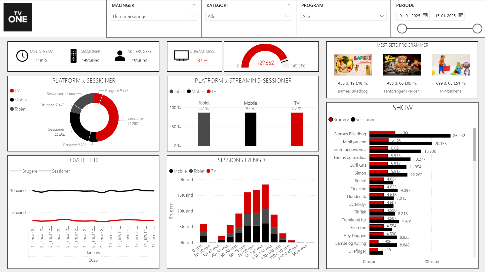
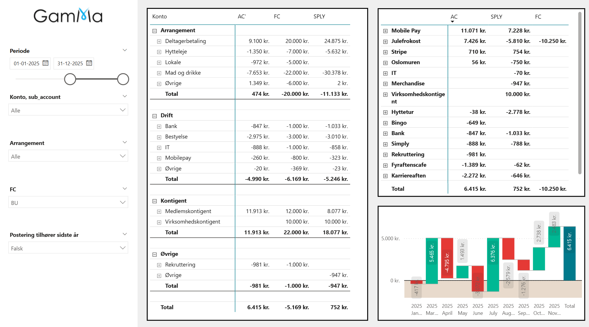
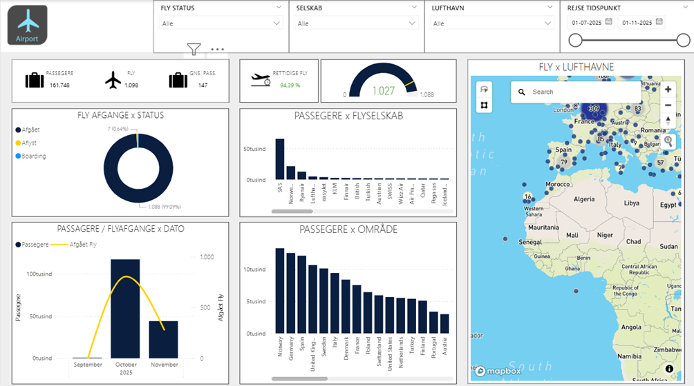
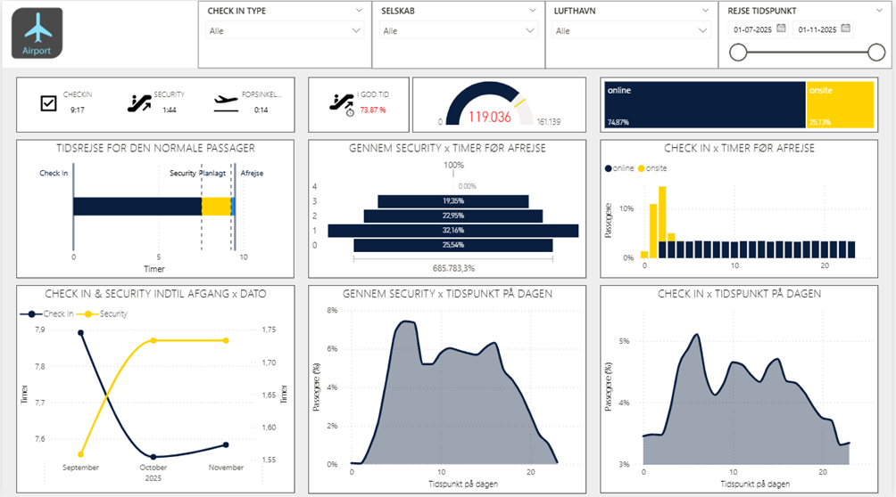

# Data-Projects

Dette repository fungerer som samlingspunkt for et antal data- og analyseskabeloner og -projekter. Formålet er at samle små projekter og genbrugelige komponenter ét sted, så struktur, kode og dokumentation er ensartet og klar til videre udvikling.

---

## Projekter

- **[TV ONE - Simulering, Data & Rapportering](docs/tv1/)**   
  Simulering af streaming- og brugeradfærd, opbygge en datamodel og levere rapportering via Power BI og Tabular Editor. 




- **[GamMa – Data & Rapportering](docs/gamma/)**   
  Automatiseret databehandling og rapportering for GamMa-foreningen.  

  

- **[Airport Project - Simulering, Data & Rapportering](docs/airport/)**   
  Simulering af streaming- og brugeradfærd, opbygge en datamodel og levere rapportering via Power BI og Tabular Editor. 

Oversigt                               |  Check In Tider                         | Udnyttelsesrate
:-------------------------------------:|:---------------------------------------:|:----------------------------------------:
  |    |  

---

## Indhold

Dette repository fungerer som en fælles ramme for flere data- og analyseprojekter.  
Strukturen er bygget til at understøtte genbrug af kode, ensartet dokumentation og hurtig opstart af nye cases.  
Hvert projekt (fx **GamMa** og **TV1 Case**) har sin egen dokumentation, ressourcer og services, men deler samme bibliotek af funktioner, scripts og runtime-definitioner.

---

### Mappestruktur

```
/data-projects
│
├── /docs
│   ├── /gamma
│   ├── /airport
│   └── /tv1
│
├── /res
│   ├── /gamma
│   ├── /airport
│   └── /tv1
│
├── /src
│   ├── /code
│   │   ├── /libraries
│   │   │   ├── /classes
│   │   │   ├── /packages
│   │   │   ├── /runners
│   │   │   └── /utils
│   │   │
│   │   ├── /runtime_definitions
│   │   │   ├── /gamma
│   │   │   ├── /airport
│   │   │   └── /tv1
│   │   │
│   │   └── /services
│   │       ├── /gamma
│   │       ├── /airport
│   │       └── /tv1
│   │
│   └── /workspace-serve
│       ├── /gamma
│       ├── /airport
│       └── /tv1
│
└── README.txt
```

Denne struktur sikrer:
- at dokumentation (`docs`) er opdelt pr. projektområde  
- at ressourcer/filer (`res`) er opdelt pr. projekt  
- at kildekode (`src`) er opdelt i fælles biblioteker, runtime-definitioner og services  
- at rapporteringsarbejder/arbejdsrum (`workspace-serve`) er organiseret pr. projekt  

---

## Formål
- At skabe et modulært greb om data-projekter, således at genbrug bliver lettere og nye cases kan startes hurtigt.  
- At give det tekniske fundament (scripts, Docker-containers, databaser, dashboards) en ensartet struktur.  
- At kunne demonstrere analytisk og teknisk kunnen — fx som led i en ansøgning, case eller portefølje.  

---

## Teknologi og rammer

- Python til data-generering, simulation, ETL og modellering.
- DBT til transformationer i PostgreSQL databasen
- PostgreSQL som database i containeriseret miljø.
- Docker (samt evt. Docker Compose) til at orkestrere services og miljøer.
- Power BI (eller tilsvarende) til rapportering og dashboarding.
- Git / GitHub som versionsstyring og samarbejdsplatform.
- Tabular Editor 2 til modellering, automatisering og generering af measures, kolonner og metadata i dine semantiske modeller.

---

## Kom godt i gang
1. Clone repository:

```bash
   git clone <URL-til-dette-repo>
   cd data-projects
```

2. Vælg det projekt du vil arbejde med (fx gamma, circlek-case eller drtv-case).

3. Navigér til mappen src/code/services/<projekt> og find Dockerfile og/eller docker-compose.yml.

4. Start miljøet:

```bash
Copy code
docker-compose up --build 
```

5. Brug script-mappen i src/code/runners eller src/code/libraries til simulation eller ETL.

6. Åbn rapporteringsarbejdet i src/workspace-serve/<projekt> — fx Power BI fil eller tilsvarende.

## Struktur- og udviklingskonventioner
- Fælles kode (utils, runners, classes) ligger i src/code/libraries og bør designes til genbrug.
- Runtime-definitioner (fx JSON-filer der konfigurerer simulation eller job-kørsler) ligger i src/code/runtime_definitions/<projekt>.
- Services (containeriserede applikationer/kørsler) ligger i src/code/services/<projekt>.
- Rapportering/arbejdsrum ligger i src/workspace-serve/<projekt>.
- Hver projektmappe (gamma, circlek-case, drtv-case) indeholder sin egen dokumentation i docs/<projekt>.


## Licens
Dette projekt er forbeholdt Abrahim Borgi.

## Kontakt
For spørgsmål eller kommentarer kan du kontakte Abrahim via GitHub-profil eller e-mail.